# LiveKit Voice Agent

A complete voice conversation pipeline built with [LiveKit](https://livekit.io/), [OpenAI](https://openai.com/), and [Rime](https://rime.ai/). This project demonstrates how to wire together a full **STT → LLM → TTS** loop to create natural, bidirectional voice conversations, and serves as a practical starting point for building your own voice agents on LiveKit.

---

## Demo

[](https://youtu.be/t2J8ce1vdtc)

---

## Architecture

```mermaid
flowchart LR
    User(["🎙️ User"])

    subgraph LiveKit Room
        direction LR
        VAD["Voice Activity\nDetection\n(Silero)"]
        STT["Speech-to-Text\n(OpenAI Whisper)"]
        LLM["Large Language\nModel\n(OpenAI GPT-4o)"]
        TTS["Text-to-Speech\n(Rime Arcana)"]
        NC["Noise\nCancellation\n(BVC)"]
    end

    Speaker(["🔊 Speaker"])

    User -->|"raw audio"| NC
    NC --> VAD
    VAD -->|"speech segments"| STT
    STT -->|"transcript"| LLM
    LLM -->|"response text"| TTS
    TTS -->|"synthesised audio"| Speaker
```



---

## Prerequisites

| Service | Purpose | Link |
|---------|---------|------|
| LiveKit Cloud | Room infrastructure + API credentials | [cloud.livekit.io](https://cloud.livekit.io/login) |
| OpenAI | STT (Whisper) + LLM (GPT-4o) | [platform.openai.com](https://platform.openai.com/api-keys) |
| Rime | Text-to-Speech | [app.rime.ai/tokens](https://app.rime.ai/tokens/) |

---

## Setup

### 1. Clone the repo

```bash
git clone https://github.com/your-org/livekit-agent.git
cd livekit-agent
```

### 2. Install `uv`

```bash
brew install uv        # macOS (skip if already installed)
```

### 3. Configure environment variables

Copy the example env file and fill in your credentials:

```bash
cp .env.local .env
```

Open `.env` and set the following:

```env
LIVEKIT_URL=wss://<your-project>.livekit.cloud
LIVEKIT_API_KEY=<your-livekit-api-key>
LIVEKIT_API_SECRET=<your-livekit-api-secret>

OPENAI_API_KEY=<your-openai-api-key>

RIME_API_KEY=<your-rime-api-key>
```

#### Where to find each key

**LiveKit** - [cloud.livekit.io](https://cloud.livekit.io/login)
1. Sign up or log in
2. Go to **Settings → API Keys**
3. Generate an API key + secret and copy your project WebSocket URL

**OpenAI** - [platform.openai.com/api-keys](https://platform.openai.com/api-keys)
1. Sign up or log in
2. Go to **Dashboard → API Keys → Create new secret key**

**Rime** - [app.rime.ai/tokens](https://app.rime.ai/tokens/)
1. Sign up or log in
2. Generate a new API token from the dashboard

### 4. Download model files

```bash
uv run main.py download-files
```

---

## Running the Agent

### Console mode *(local testing, no LiveKit room required)*

```bash
uv run main.py console
```

Runs the full pipeline in your terminal. Speak into your microphone and the agent will respond over your speakers. Great for rapid iteration without needing a cloud room.

### Development mode *(connects to LiveKit Cloud)*


```bash
uv run main.py dev
```

Registers the agent as a worker against your LiveKit project. Join the room from the [LiveKit Playground](https://agents-playground.livekit.io/) or any LiveKit-compatible client to test end-to-end.

### Production mode

```bash
uv run main.py start
```

Runs the agent in production mode, ready to handle concurrent rooms at scale.

